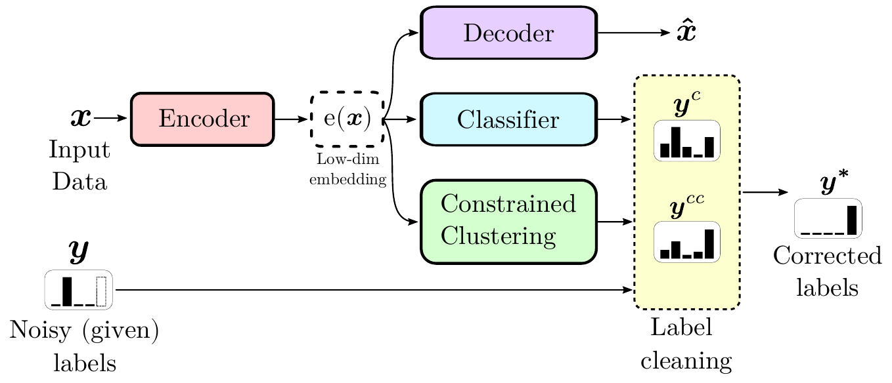

## SREA: Self-Re-Labeling with Embedding Analysis

This repository contains the implementation of the methods proposed in the paper [Estimating the electrical power output of industrial devices with end-to-end time-series classification in the presence of label noise](https://arxiv.org/abs/2105.00349) by Andrea Castellani, Sebastian Schmitt and Barbara Hammer (accepted at ECML 2021).

<div align="center">

      
Figure 1: SREA architecture.
</div>


[arXiv:2105.00349](https://arxiv.org/abs/2105.00349) Abstract:

> <div align='justify'>In complex industrial settings, it is common practice to monitor the operation of machines in order to detect undesired states, adjust maintenance schedules, optimize system performance or collect usage statistics of individual machines. In this work, we focus on estimating the power output of a Combined Heat and Power (CHP) machine of a medium-sized company facility by analyzing the total facility power consumption. We formulate the problem as a time-series classification problem where the class label represents the CHP power output. As the facility is fully instrumented and sensor measurements from the CHP are available, we generate the training labels in an automated fashion from the CHP sensor readings. However, sensor failures result in mislabeled training data samples which are hard to detect and remove from the dataset. Therefore, we propose a novel multi-task deep learning approach that jointly trains a classifier and an autoencoder with a shared embedding representation. The proposed approach targets to gradually correct the mislabelled data samples during training in a self-supervised fashion, without any prior assumption on the amount of label noise. We benchmark our approach on several time-series classification datasets and find it to be comparable and sometimes better than state-of-the-art methods. On the real-world use-case of predicting the CHP power output, we thoroughly evaluate the architectural design choices and show that the final architecture considerably increases the robustness of the learning process and consistently beats other recent state-of-the-art algorithms in the presence of unstructured as well as structured label noise.</div>

## Requirements
- Ubuntu 18.04.5
- Python 3.7+
- NumPy 1.20+
- SciPy 1.6.3
- PyTorch 1.4.0+
- Matplotlib 3.3.2
- Scikit-Learn 0.23.2
- Cuda 11.2

Install PyTorch (Conda):
```bash
conda install pytorch numpy scipy matplotlib scikit-learn -c torch
```

### Folder structure

```bash
.
├── src/                      # code folder
│   ├── models/               # contains the models and meta-models used
│   ├── utils/                # contains helper functions
│   ├── SREA_single_experimet.py
│   ├── SREA_ablation_hyperpar.py
│   ├── BMM_single_experiment.py
│   ├── coteaching_single_experiment.py
│   ├── SOTA_cumulative_experiments.py
├── results/                  # results folder (generated after the first run)
│   ├── <scriptname>/         # results organized by scriptname/datetime 
│   │   ├── <datetime>/
│   │   └── ...
│   └── ...
├── run_hyper_ablation.sh     # script to reproduce SREA hyperparameters sensitivity on UCR datasets
├── run_loss_ablation.sh      # script to reproduce SREA loss function ablation on UCR datasets
├── run_sota_experiments.sh   # script to reproduce state-of-the-art comparisons
└── ...
```

### Description and example
... coming soon ...


## Acknowledgements
For the PyTorch implementation of the state-of-the-art algorithm to compare SREA with, we adapted the following open-source implementation:
* [MixUp and MixUp-GMM](https://github.com/PaulAlbert31/LabelNoiseCorrection) (https://github.com/PaulAlbert31/LabelNoiseCorrection)
* [SIGUA](https://github.com/bhanML/SIGUA)(https://github.com/bhanML/SIGUA)
* [Co-Teaching](https://github.com/bhanML/Co-teaching)(https://github.com/bhanML/Co-teaching)


## Citing SREA
If this code has been useful, use this:
```BibTex
@inproceedings{castellani2021estimating,
      title={Estimating the electrical power output of industrial devices with end-to-end time-series classification in the presence of label noise}, 
      author={Andrea Castellani and Sebastian Schmitt and Barbara Hammer},
      year={2021},
      booktitle={ECML/PKDD}
}
```

## Contacts
For any question, bug or other, do not hesitate to open a pull request and contact me directly via email:
Andrea Castellani - acastellani@techfak.uni-bielefeld.de - a.castellani93@gmail.com

